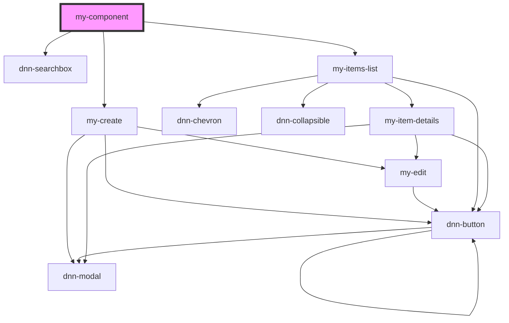

# my-component

Root component that does all the module rendering.

<!-- Auto Generated Below -->


## Usage

### Dnn

In Dnn SPA module content (when the view is an .html file), you can use some tokens to inject the module id. Learn more about those tokens at [DnnDocs](https://dnndocs.com/content/tutorials/modules/about-modules/spa-module-development/index.html#accessing-dnn-features).

In this example we use `[[AntiForgeryToken:True]]` to secure our api calls and ensure they only come from our page. We also use `[ModuleContext:ModuleId]` in order to inject our module id so we can call the proper apis and have a module context in the backend.

```html
[AntiForgeryToken:True]
<script type="module" src="DesktopModules/Contacts/resources/scripts/acm-contacts/acm-contacts.esm.js"></script>
<script nomodule="" src="DesktopModules/Contacts/resources/scripts/acm-contacts/acm-contacts.js"></script>
<my-component module-id="[ModuleContext:ModuleId]" />
```


### Javascript

Simply load the javascript library, provide it a module id and you are good to go.

```html
    <!DOCTYPE html>
    <html lang="en">
    <head>
        <meta charset="UTF-8">
        <meta name="viewport" content="width=device-width, initial-scale=1.0">
        <title>Document</title>
       <script type="module" src="some-path/acm-contacts.esm.js"></script>
       <script nomodule="" src="some-path/acm-contacts.js"></script>
    </head>
    <body>
        <my-component module-id="123" />        
    </body>
    </html>
```


## Properties

| Property                | Attribute   | Description                                                  | Type     | Default     |
| ----------------------- | ----------- | ------------------------------------------------------------ | -------- | ----------- |
| `moduleId` _(required)_ | `module-id` | The Dnn module id, required in order to access web services. | `number` | `undefined` |


## Dependencies

### Depends on

- dnn-searchbox
- [my-create](../my-create)
- [my-items-list](../my-items-list)

### Graph


----------------------------------------------

*Built with [StencilJS](https://stenciljs.com/)*
