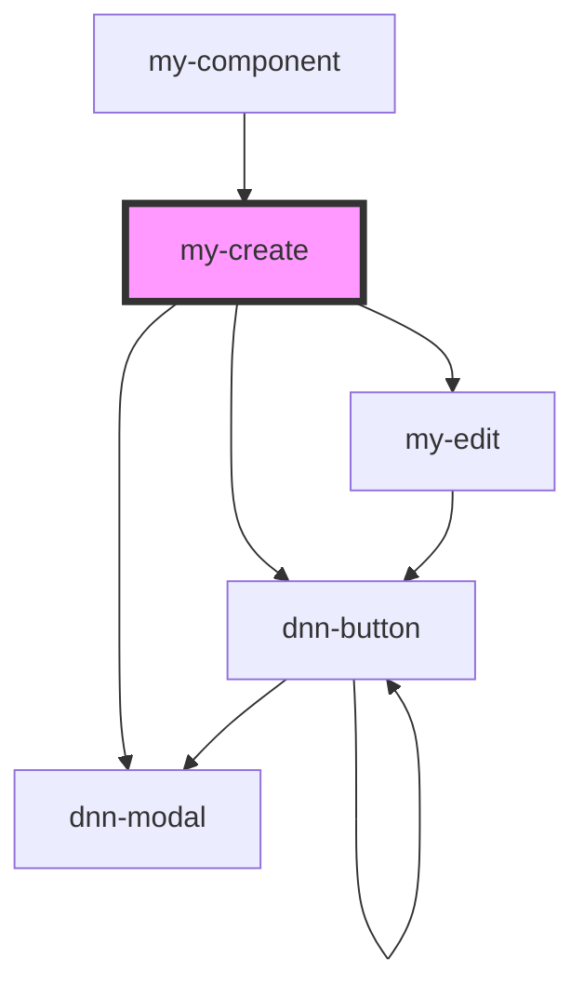

# my-create

<!-- Auto Generated Below -->

## Dependencies

### Used by

 - [my-component](../my-component)

### Depends on

- dnn-button
- dnn-modal
- [my-edit](../my-edit)

### Graph

----------------------------------------------

*Built with [StencilJS](https://stenciljs.com/)*
