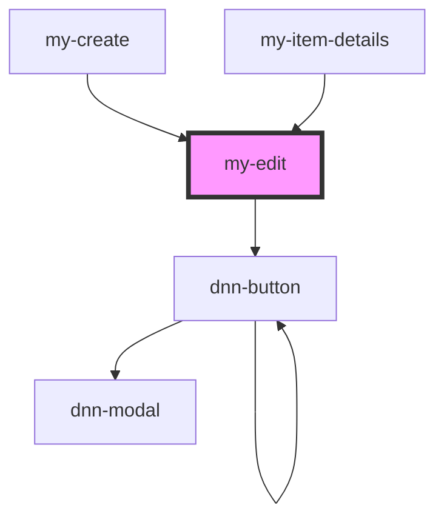

# my-edit

<!-- Auto Generated Below -->

## Properties

| Property | Attribute | Description                 | Type             | Default     |
| -------- | --------- | --------------------------- | ---------------- | ----------- |
| `item`   | --        | The item to create or edit. | `IItemViewModel` | `undefined` |

## Events

| Event         | Description                        | Type               |
| ------------- | ---------------------------------- | ------------------ |
| `itemCreated` | Fires up when an item got created. | `CustomEvent<any>` |

## Methods

### `resetForm() => Promise<void>`

Resets the form to insert a new item.

#### Returns

Type: `Promise<void>`

### `setFocus() => Promise<void>`

Sets focus on the first form element

#### Returns

Type: `Promise<void>`

## Dependencies

### Used by

 - [my-create](../my-create)
 - [my-item-details](../my-item-details)

### Depends on

- dnn-button

### Graph

----------------------------------------------

*Built with [StencilJS](https://stenciljs.com/)*
