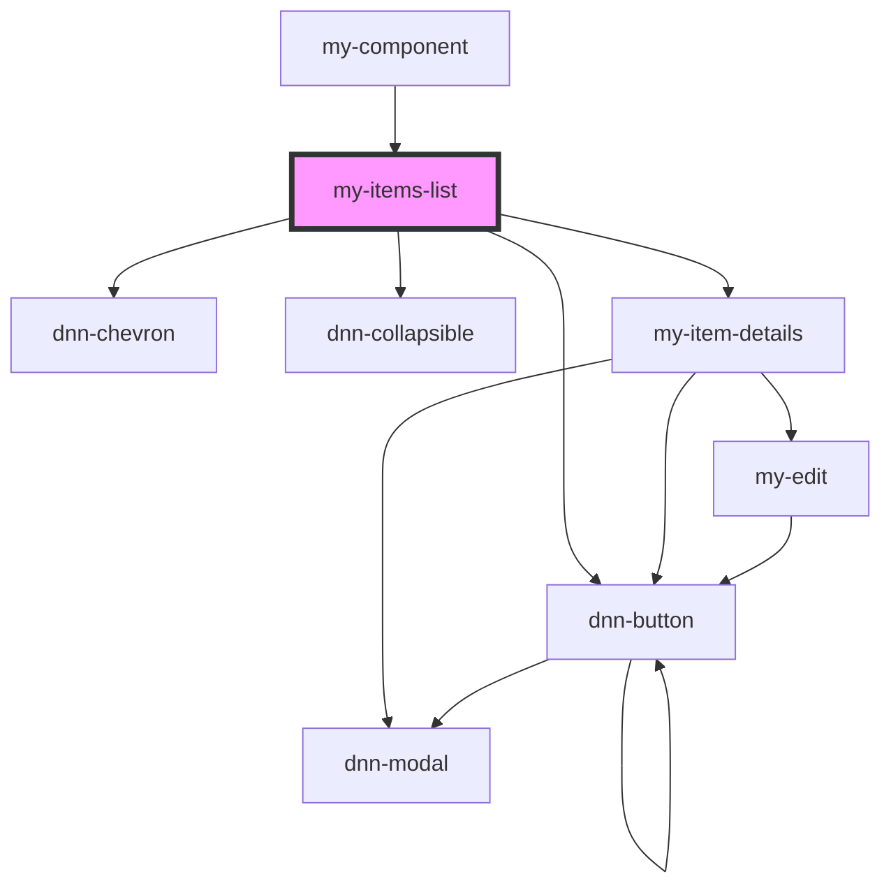

# my-items-list

<!-- Auto Generated Below -->

## Properties

| Property        | Attribute        | Description                                        | Type     | Default |
| --------------- | ---------------- | -------------------------------------------------- | -------- | ------- |
| `pageSize`      | `page-size`      | Defines how many items to fetch per request.       | `number` | `100`   |
| `preloadPixels` | `preload-pixels` | Defines how many pixels under the fold to preload. | `number` | `1000`  |

## Dependencies

### Used by

 - [my-component](../my-component)

### Depends on

- dnn-chevron
- dnn-collapsible
- [my-item-details](../my-item-details)
- dnn-button

### Graph

----------------------------------------------

*Built with [StencilJS](https://stenciljs.com/)*
